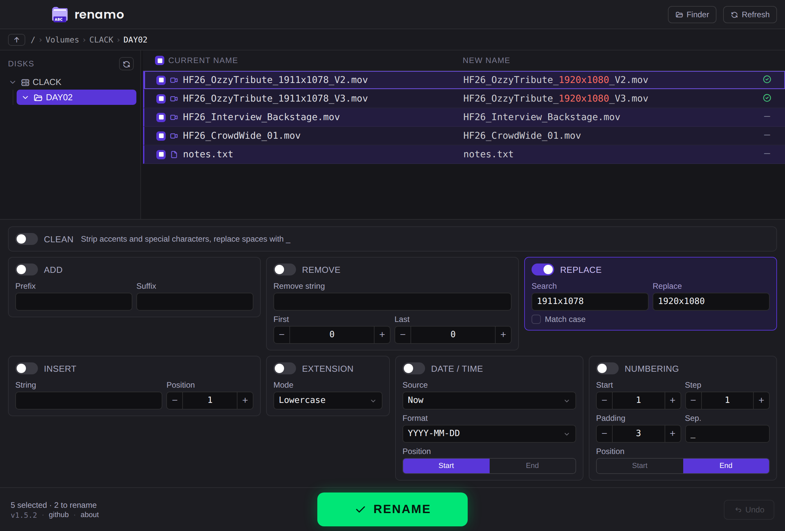

# renamo

Batch rename files and folders with a live preview. Build a new name from independent rules, then see the result before you commit.

macOS and Windows. Built with Electron. No dependencies, no sign-up.



## Features

- Browse your disks, select files or folders
- Independent rules: insert, add, remove, replace, extension, date/time, numbering
- CLEAN: strip accents and special characters, replace spaces with underscores
- Live preview with the changed part shown in red and name-collision detection
- Two-phase rename with one-click undo of the last batch
- Resizable disk browser, full keyboard navigation

## Build from source

Requires Node.js. From the project root:

```
npm install
./build.sh        # macOS DMG (arm64)
./build-win.sh    # Windows installer (NSIS) + zip
```

Both installers display the GNU GPL v3 license during installation.

Building the Windows installer from macOS needs Wine; without it the script produces a portable .zip instead of the .exe. See the comments in build-win.sh.

## Updates

On launch, renamo checks its own version.json in this repository and shows a notice if a newer version exists. Nothing else is sent. If you fork renamo, update the URL in src/main.js (UPDATE_URL) to point to your own version.json, or remove the check.

## Third-party components

- Electron (MIT)
- Tabler Icons (MIT)
- Poppins typeface, used for the wordmark (SIL Open Font License 1.1, see src/fonts/Poppins-OFL.txt)

## License

renamo is free software, licensed under the GNU General Public License v3.0 or later. See the LICENSE file for the full text.

Copyright (C) 2026 just edit
