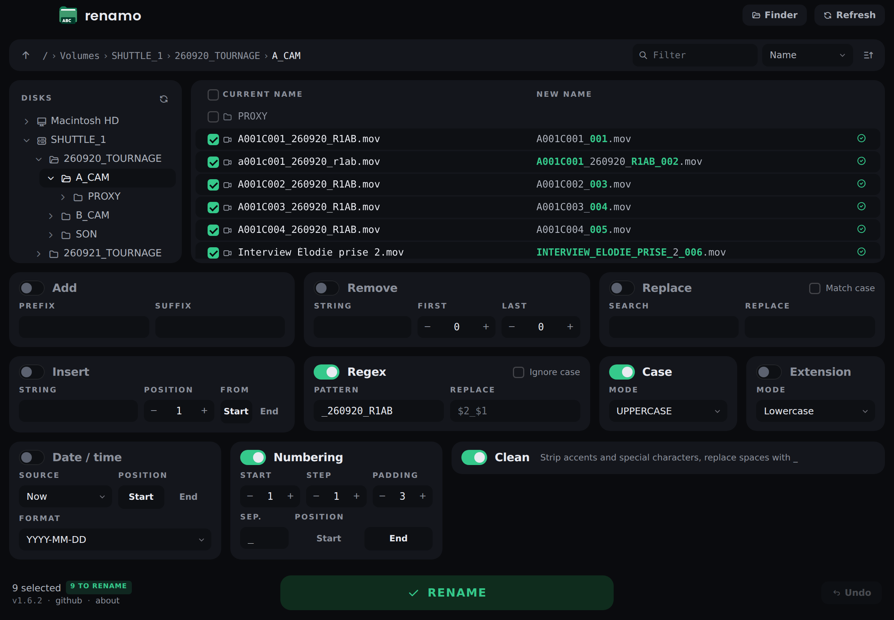

# renamo

Batch rename files and folders with a live preview. Build a new name from independent rules, then see the result before you commit.

macOS and Windows. Built with Electron. No dependencies, no sign-up.



## Features

- Browse your disks, select files or folders, or drop them in from Finder / Explorer
- Independent rules: insert, add, remove, replace, regex, case, extension, date/time, numbering
- REGEX: JavaScript patterns with `$1`, `$2` capture groups, optional case-insensitive matching
- CASE: lowercase, UPPERCASE, Title Case or Sentence case on the name, extension untouched
- CLEAN: strip accents and special characters, replace spaces with underscores
- Sort the list by name, date created, date modified, size or type — numbering follows that order
- Filter the list (Cmd/Ctrl+F); hidden rows are never renamed
- Range selection with shift-click or shift+arrows, select all with Cmd/Ctrl+A
- Live preview with the changed part shown in red and name-collision detection
- Two-phase rename with one-click undo of the last batch
- Resizable disk browser, full keyboard navigation

### Rule order

Rules always apply in the same order, on the name without its extension:

`INSERT → REMOVE → REPLACE → REGEX → CASE → ADD → DATE/TIME → NUMBERING → CLEAN`,
then the EXTENSION rule on the extension itself. CASE runs before ADD, so a prefix
or suffix you type is kept exactly as typed.

## Build from source

Requires Node.js. From the project root:

```
npm install
npm test          # rename-engine checks, no build needed
./release.sh      # tests + macOS DMG + Windows, in one go
./build.sh        # macOS DMG (arm64) only
./build-win.sh    # Windows installer (NSIS) + zip only
```

The three scripts are committed with the executable bit set. If your copy came
from a zip or an archive that dropped it, restore it once with
`chmod +x release.sh build.sh build-win.sh`.

Both installers display the GNU GPL v3 license during installation.

Building the Windows installer from macOS needs Wine; without it the script produces a portable .zip instead of the .exe. See the comments in build-win.sh.

## Updates

On launch, renamo checks its own version.json in this repository and shows a notice if a newer version exists. Nothing else is sent. If you fork renamo, update the URL in src/main.js (UPDATE_URL) to point to your own version.json, or remove the check.

## Third-party components

- Electron (MIT)
- Tabler Icons (MIT)
- Poppins typeface, used for the wordmark (SIL Open Font License 1.1, see src/fonts/Poppins-OFL.txt)

## License

renamo is free software, licensed under the GNU General Public License v3.0 or later. See the LICENSE file for the full text.

Copyright (C) 2026 just edit
